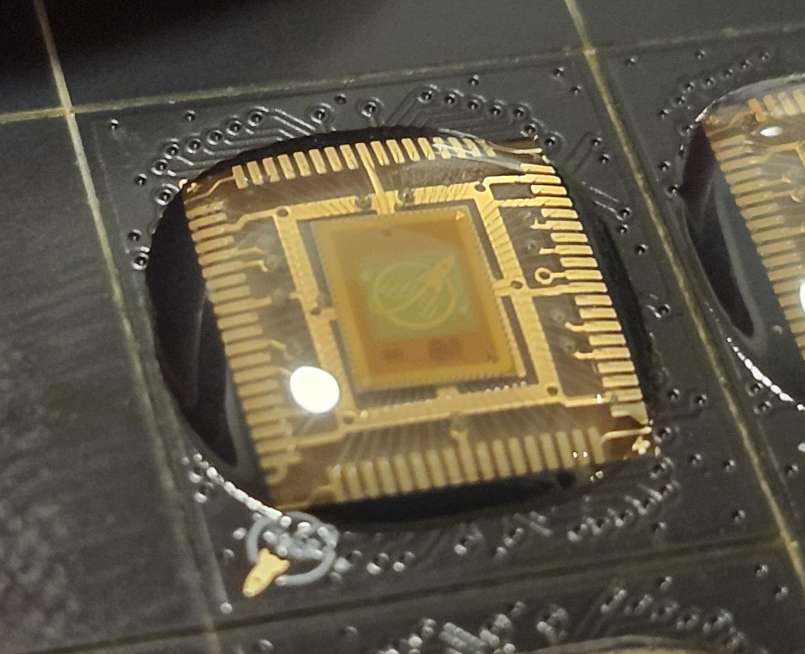
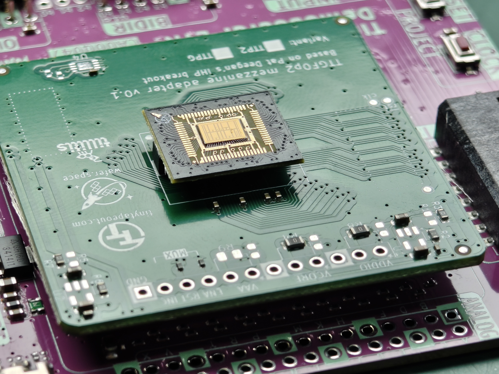
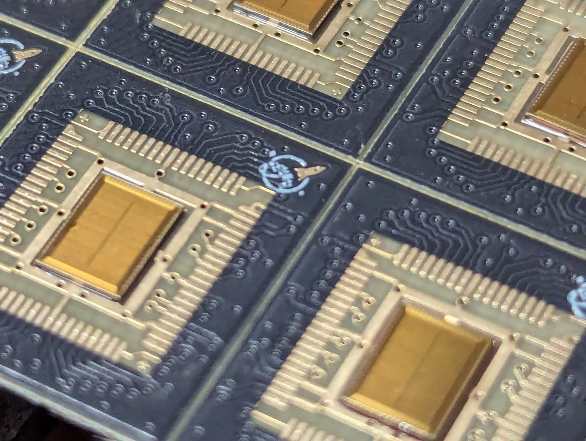
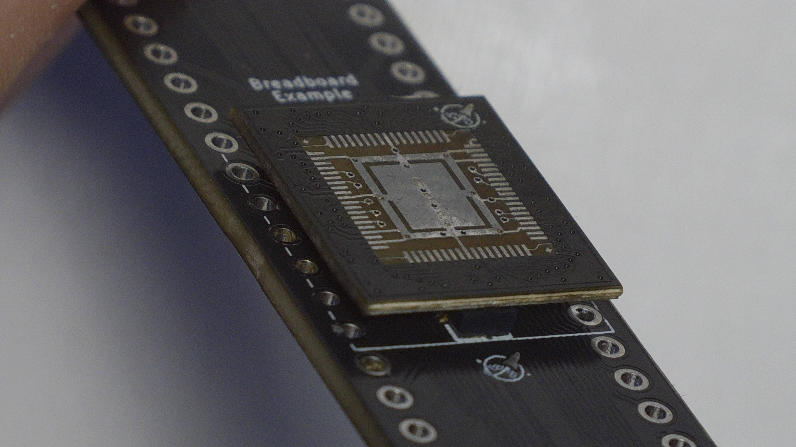
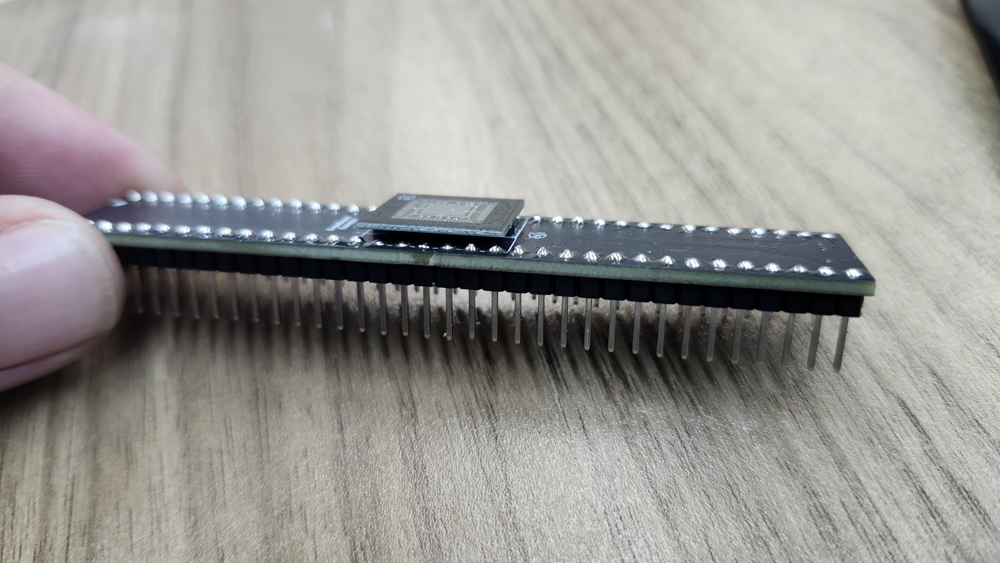

# Chip-on-Board Wire-Bonded PCBs

> **Status:** Work in Progress

This repository serves as the primary workspace and documentation hub for [**wafer.space**](https://wafer.space).

Our current padframe and wirebonding layouts follow the [**Tiny Tapeout**](https://tinytapeout.com/) convention of 74 pads.
All ground (GND) connections are tied together in the **Default Breakout COB package**.

---

## First Run

[**wafer.space**](https://wafer.space) completed its **successful first run**, delivering working chip-on-board (COB) packages to customers. The boards below are the actual COB parts that were wire-bonded and shipped as part of Run 1 — real silicon, packaged and ready to drop into a breakout motherboard.

See [**Run 1**](./run-1/README.md) for the full padframe reference, pinouts, and design requirements behind these parts.

---

## Run Documentation

Pinouts, connector choices, and footprint dimensions are **run-specific** and documented per run.

* [**Run 1**](./run-1/README.md) — padframe reference / pinouts, example COB layout, mezzanine connectors, and design requirements
  * [Wirebonding detail and design rules](./run-1/1x1-cob/wirebonding/README.md)
  * [Example motherboards](./run-1/motherboards/README.md)

---

## Example Motherboards

We provide example **breakout motherboard** designs that mate with the COB packages via the 70-pin mezzanine connector. See the [**Motherboards directory**](./run-1/motherboards/README.md) for KiCad schematics, layouts, and symbols.

---

### 70-Pin Mezzanine Connector Symbol

The **mezzanine connector symbol** provides a 1:1 pin mapping to the 70-pin default layout. You can find these symbols in the [Motherboards examples](./run-1/motherboards/README.md). 
All pins are aliased to match [Tiny Tapeout](https://tinytapeout.com/) naming conventions.

*Default 70-pin mezzanine COB breakout symbol*

We also provide an alternate version that organizes pins by signal type. Ideal for Tiny Tapeout breakout motherboard designs.

*Default 70-pin mezzanine COB breakout symbol TT version*
