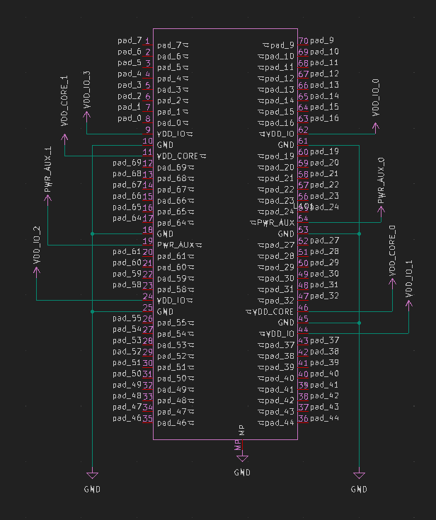
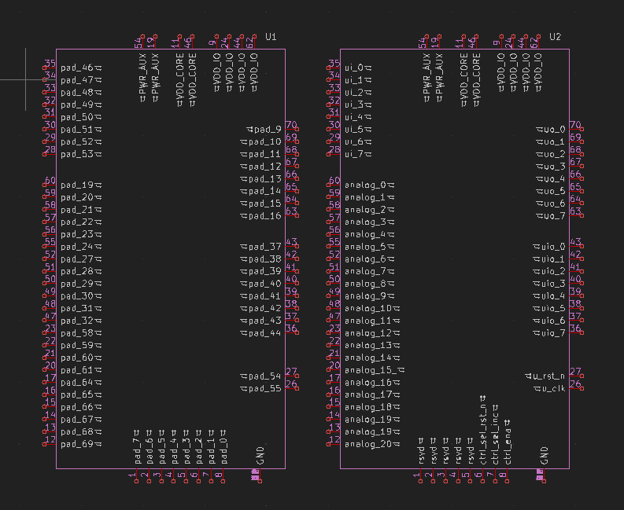

# Chip-on-Board Wire-Bonded PCBs

> **Status:** Work in Progress

This repository serves as the primary workspace and documentation hub for [**wafer.space**](https://wafer.space).

Our current padframe and wirebonding layouts follow the [**Tiny Tapeout**](https://tinytapeout.com/) convention of 74 pads.
All ground (GND) connections are tied together in the **Default Breakout COB package**.

---

## Run Documentation

Pinouts, connector choices, and footprint dimensions are **run-specific** and documented per run.

* [**Run 1**](./run-1/README.md) — padframe reference / pinouts, example COB layout, mezzanine connectors, and design requirements
  * [Wirebonding detail and design rules](./run-1/1x1-cob/wirebonding/README.md)
  * [Example motherboards](./run-1/motherboards/README.md)

---

## Default KiCad Symbols

We have developed several **KiCad symbols** to support design and integration with our COB layouts.

The **pad mapping symbol** corresponds to the default 74-pad wirebonding padframe and [default configuration](https://github.com/wafer-space/gf180mcu-project-template/blob/main/librelane/config.yaml) from the [**GF180MCU Project Template**](https://github.com/wafer-space/gf180mcu-project-template).

> Some users have suggested reducing the number of ground and power pads. If there is sufficient demand, an alternate default configuration will be created.
> Join the discussion on our [**Discord server**](https://discord.gg/43y2t53jpE).

*Default 74-pad wirebonding padframe*

---

### 70-Pin Mezzanine Connector Symbol

The **mezzanine connector symbol** provides a 1:1 pin mapping to the 70-pin default layout.
All pins are aliased to match [Tiny Tapeout](https://tinytapeout.com/) naming conventions.

*Default 70-pin mezzanine COB breakout symbol*

We also provide an alternate version that organizes pins by signal type. Ideal for Tiny Tapeout breakout motherboard designs.

*Default 70-pin mezzanine COB breakout symbol TT version*
