# Run 1

This directory holds the design files for **Run 1** of the [wafer.space](https://wafer.space)
chip-on-board (COB) breakouts.

> **Note:** The pinouts, connector choices, and footprint dimensions documented here are
> **specific to this run** and are expected to change in future runs. Treat this page as the
> source of truth for Run 1 only.

## Contents

| Directory | Description |
| --------- | ----------- |
| [`1x1-cob/`](1x1-cob/) | 14 mm × 16 mm 74-pad / 70-pin mezzanine COB breakout |
| [`1x0p5-cob/`](1x0p5-cob/) · [`0p5x1-cob/`](0p5x1-cob/) | Half-slot COB variants |
| [`wirebonding/`](wirebonding/README.md) | Wirebonding layout and design rules |
| [`motherboards/`](motherboards/README.md) | Example breakout motherboards |

---

## Padframe Reference

Our current padframe and wirebonding layouts follow the [**Tiny Tapeout**](https://tinytapeout.com/)
convention of 74 pads. All ground (GND) connections are tied together in the
**Default Breakout COB package**.

| Bond Pad | Breakout Pad | Default                                                    | TT Function                                                |
| -------- | ------------ | ---------------------------------------------------------- | ---------------------------------------------------------- |
| 0        | 1            | user_defined                                               | ctrl_ena                                                   |
| 1        | 2            | user_defined                                               | ctrl_sel_inc                                               |
| 2        | 3            | user_defined                                               | ctrl_sel_rst_n                                             |
| 3–7      | 4–8          | user_defined                                               | rsvd                                                       |
| 8        | 9            | GND IO  | GND IO  |
| 9–16     | 10–17        | user_defined                                               | uo[0–7]                                                    |
| 17       | 18           | VDD IO   | VDD IO   |
| 18       | 19           | GND IO  | GND IO  |
| 19–24    | 20–25        | user_defined                                               | analog[0–5]                                                |
| 25       | 26           | PWR Aux | PWR Aux |
| 26–72    | 27–73        | *(see full table for details)*                             | —                                                          |
| 73       | 74           | VDD IO   | VDD IO   |

> For the complete mapping and color-coded reference, please refer to this [spreadsheet](https://docs.google.com/spreadsheets/d/1pI2BAEWEexXcXN3vah3SR85zPIV6eAXPGXc2bcvoSGU)

---

## Example COB Layout

> *Note: Pin numbering and naming conventions are still evolving.*

Space has been allocated for optional components such as decoupling capacitors and other passive elements.

**Proposed Mezzanine Connectors:**

* 70-pin, 0.4 mm pitch: [LCSC C19089236](https://www.lcsc.com/product-detail/C19089236.html)
* Mating connector: [LCSC C19089262](https://www.lcsc.com/product-detail/C19089262.html)

---

## Default KiCad Symbols

We have developed several **KiCad symbols** to support design and integration with our COB layouts.

The **pad mapping symbol** corresponds to the default 74-pad wirebonding padframe and [default configuration](https://github.com/wafer-space/gf180mcu-project-template/blob/main/librelane/config.yaml) from the [**GF180MCU Project Template**](https://github.com/wafer-space/gf180mcu-project-template).

> Some users have suggested reducing the number of ground and power pads. If there is sufficient demand, an alternate default configuration will be created.
> Join the discussion on our [**Discord server**](https://discord.gg/43y2t53jpE).

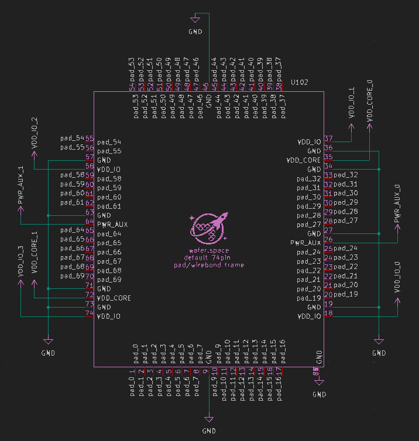
*Default 74-pad wirebonding padframe*
---

## Default Design Requirements

To maintain compatibility across projects, **default breakouts** must share:

* The same **wirebonding layout**
* The same **PCB footprint** (14 mm × 16 mm)
* The same **connector position** (if applicable)

Traces, signal types, and net assignments are **user-definable**.

---

<!-- AUTO-GEN:START -->
<!-- Generated by .github/scripts/gen_docs.py on release. Edits between the AUTO-GEN markers will be overwritten. -->

## Board Renders

*Generated for release **unreleased** on 2026-10-08.*

### 0p5x1-cob / mezzanine-0p5x1

| 3D top | 3D bottom |
| :---: | :---: |
|  | 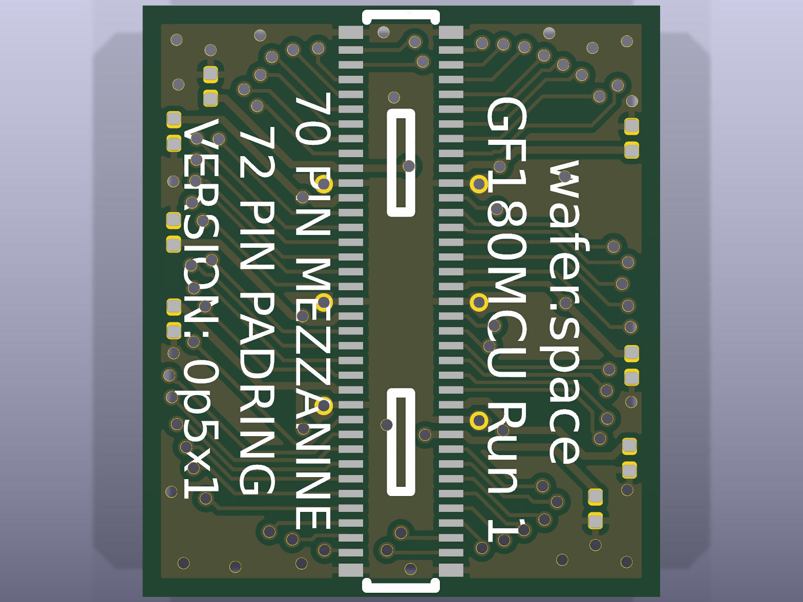 |

| Front layers | Back layers (mirrored) |
| :---: | :---: |
|  |  |

[PCB](0p5x1-cob/mezzanine-0p5x1.kicad_pcb) · [Schematic source](0p5x1-cob/mezzanine-0p5x1.kicad_sch) · [Schematic PDF](../docs/renders/run-1/0p5x1-cob/mezzanine-0p5x1/schematic.pdf)

### 0p5x1-cob / panelization / panel

| 3D top | 3D bottom |
| :---: | :---: |
|  | 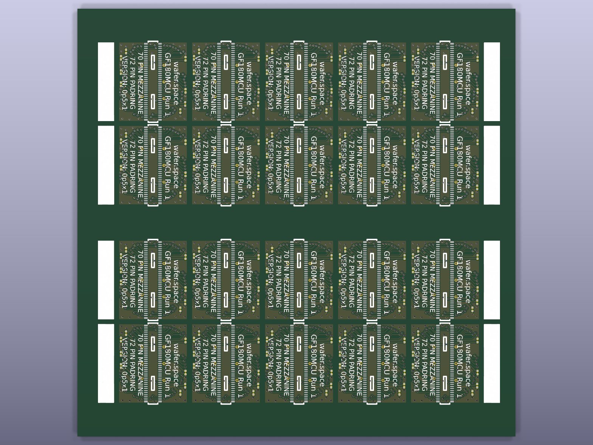 |

| Front layers | Back layers (mirrored) |
| :---: | :---: |
|  |  |

[PCB](0p5x1-cob/panelization/panel.kicad_pcb)

### 1x0p5-cob / mezzanine-1x0p5

| 3D top | 3D bottom |
| :---: | :---: |
|  | 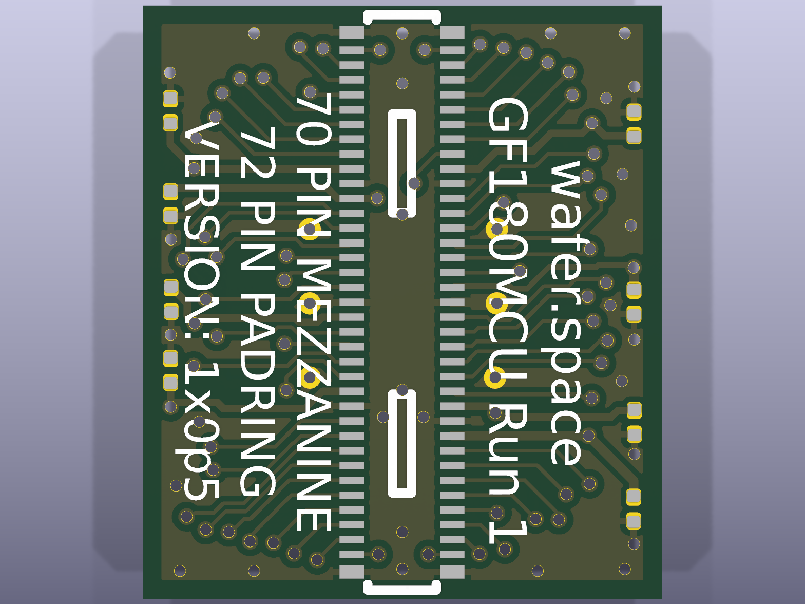 |

| Front layers | Back layers (mirrored) |
| :---: | :---: |
|  | 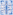 |

[PCB](1x0p5-cob/mezzanine-1x0p5.kicad_pcb) · [Schematic source](1x0p5-cob/mezzanine-1x0p5.kicad_sch) · [Schematic PDF](../docs/renders/run-1/1x0p5-cob/mezzanine-1x0p5/schematic.pdf)

### 1x0p5-cob / panelization / panel

| 3D top | 3D bottom |
| :---: | :---: |
|  | 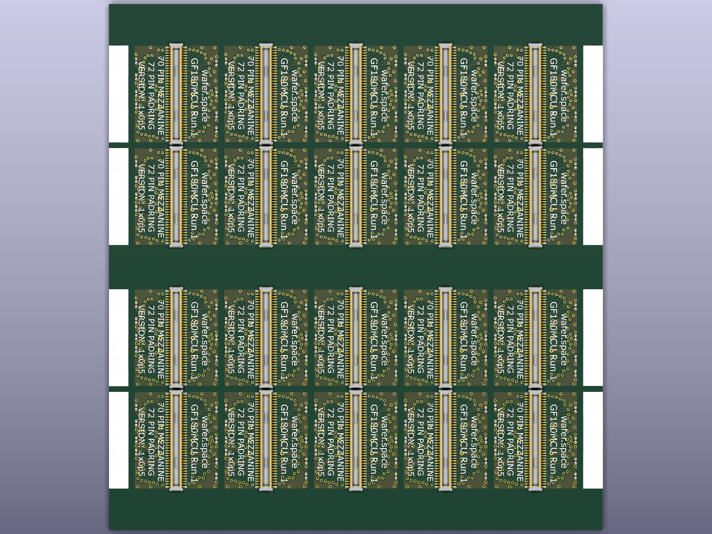 |

| Front layers | Back layers (mirrored) |
| :---: | :---: |
|  |  |

[PCB](1x0p5-cob/panelization/panel.kicad_pcb)

### 1x1-cob / 1x1-mezzanine

| 3D top | 3D bottom |
| :---: | :---: |
|  | 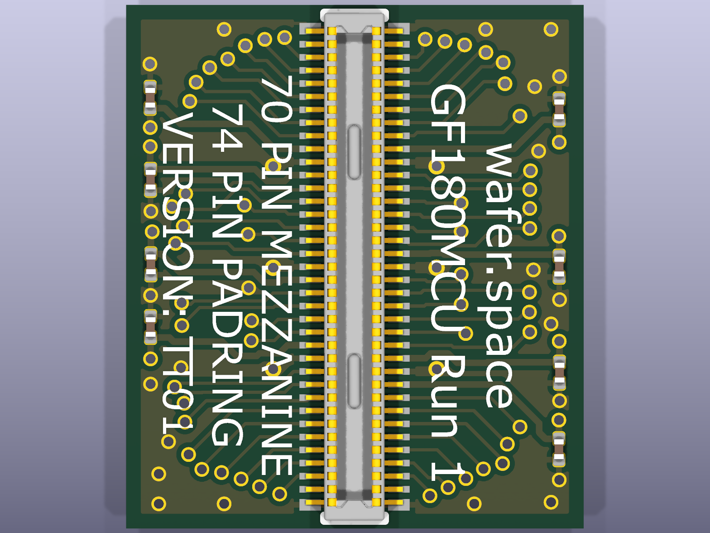 |

| Front layers | Back layers (mirrored) |
| :---: | :---: |
|  |  |

[PCB](1x1-cob/1x1-mezzanine.kicad_pcb) · [Schematic source](1x1-cob/1x1-mezzanine.kicad_sch) · [Schematic PDF](../docs/renders/run-1/1x1-cob/1x1-mezzanine/schematic.pdf)

### 1x1-cob / panelization / panel

| 3D top | 3D bottom |
| :---: | :---: |
|  | 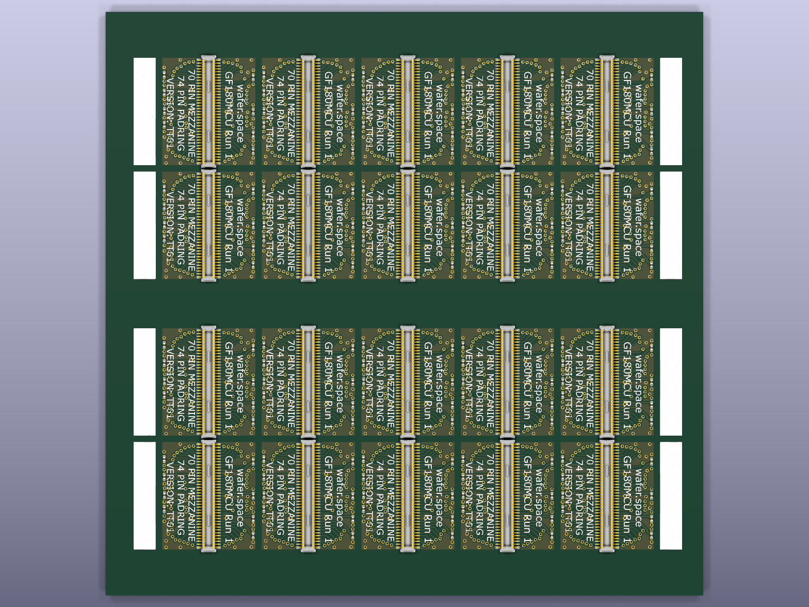 |

| Front layers | Back layers (mirrored) |
| :---: | :---: |
|  |  |

[PCB](1x1-cob/panelization/panel.kicad_pcb)

### mosbius-panel / panel

| 3D top | 3D bottom |
| :---: | :---: |
|  | 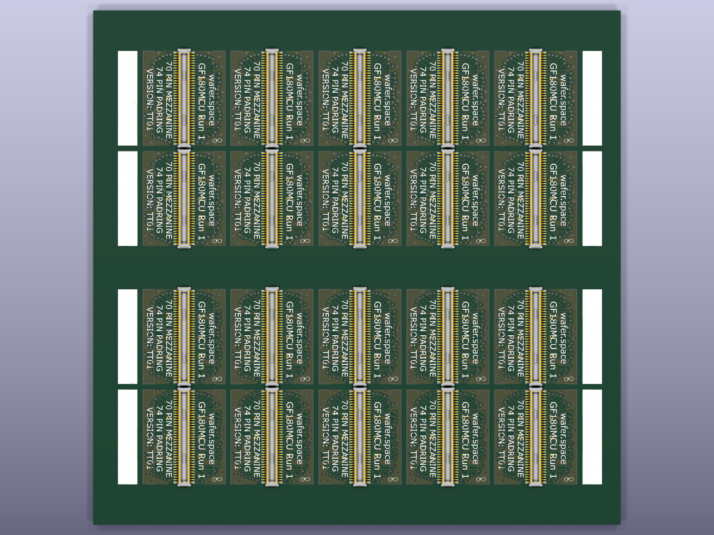 |

| Front layers | Back layers (mirrored) |
| :---: | :---: |
| 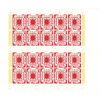 |  |

[PCB](mosbius-panel/panel.kicad_pcb)

### mosbius-panel / V3_COB_Original

| 3D top | 3D bottom |
| :---: | :---: |
|  | 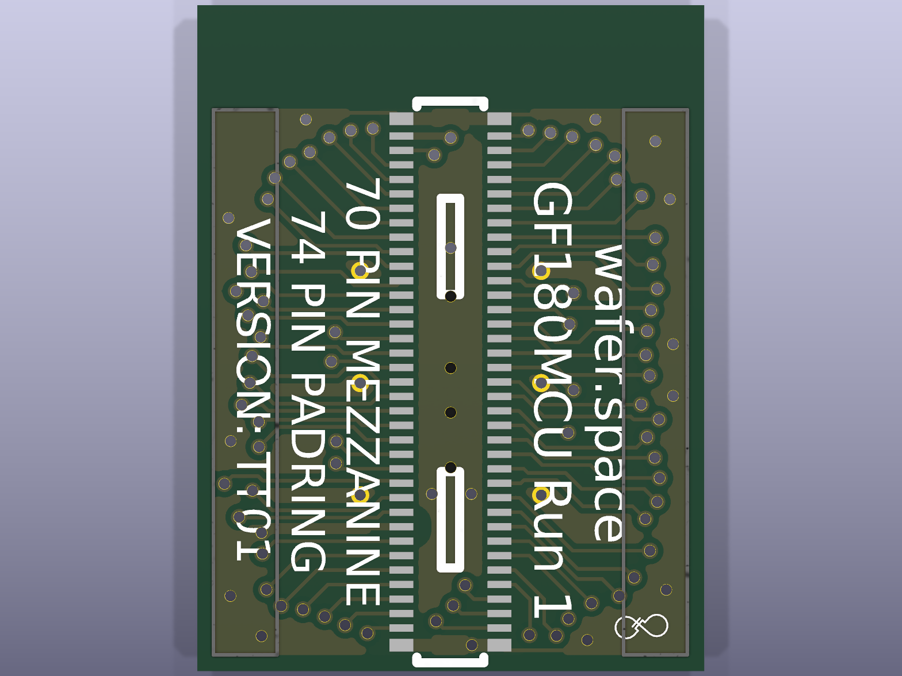 |

| Front layers | Back layers (mirrored) |
| :---: | :---: |
|  |  |

[PCB](mosbius-panel/V3_COB_Original.kicad_pcb)

### motherboards / motherboards

| 3D top | 3D bottom |
| :---: | :---: |
|  | 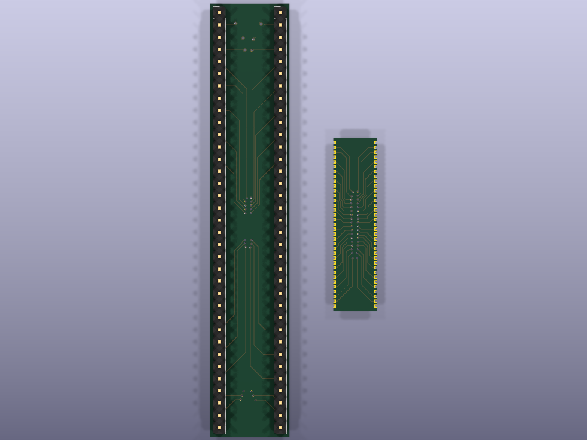 |

| Front layers | Back layers (mirrored) |
| :---: | :---: |
| 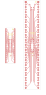 | 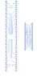 |

[PCB](motherboards/motherboards.kicad_pcb) · [Schematic source](motherboards/motherboards.kicad_sch) · [Schematic PDF](../docs/renders/run-1/motherboards/motherboards/schematic.pdf)

### tqva-cob / panellization / panel

| 3D top | 3D bottom |
| :---: | :---: |
|  | 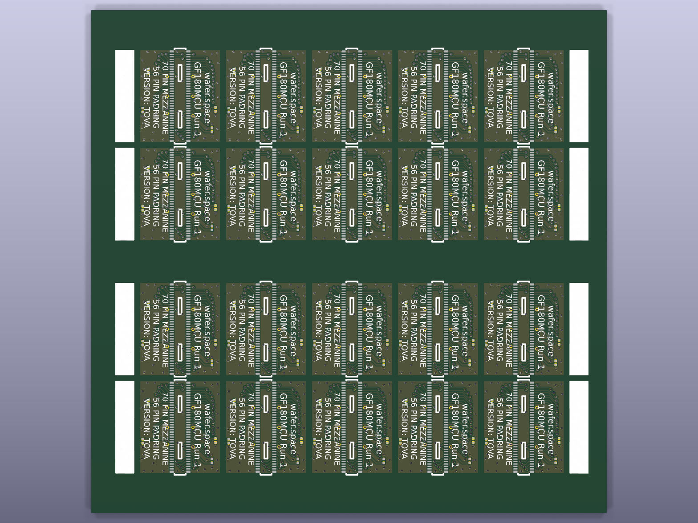 |

| Front layers | Back layers (mirrored) |
| :---: | :---: |
| 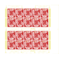 | 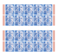 |

[PCB](tqva-cob/panellization/panel.kicad_pcb)

### tqva-cob / tqva-cob

| 3D top | 3D bottom |
| :---: | :---: |
|  | 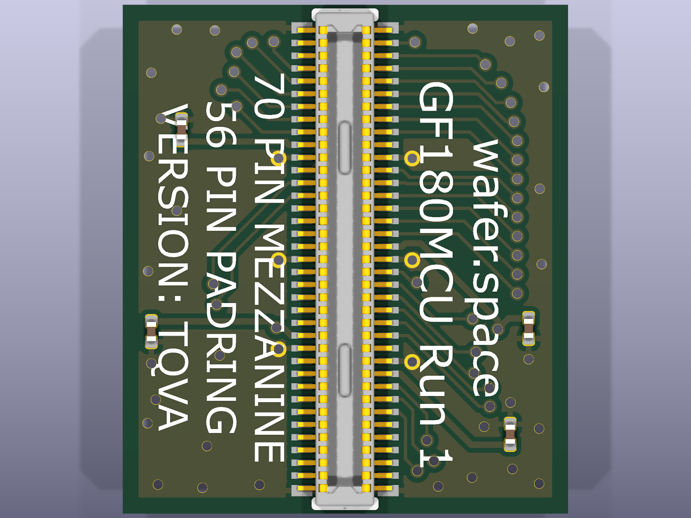 |

| Front layers | Back layers (mirrored) |
| :---: | :---: |
|  |  |

[PCB](tqva-cob/tqva-cob.kicad_pcb) · [Schematic source](tqva-cob/tqva-cob.kicad_sch) · [Schematic PDF](../docs/renders/run-1/tqva-cob/tqva-cob/schematic.pdf)
<!-- AUTO-GEN:END -->
