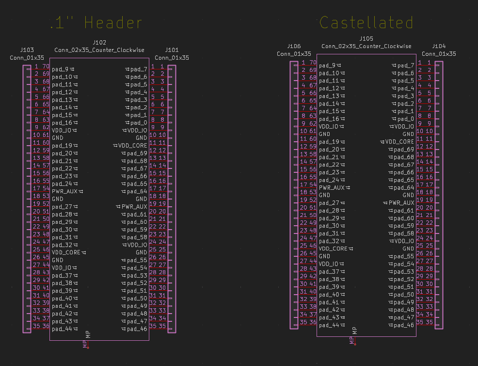
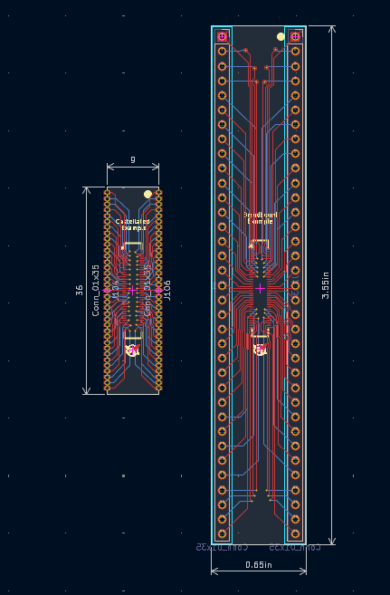

# Example Motherboards

We've designed several example breakout and motherboard PCBs to simplify development and
integration with your custom chips.

We have also developed a set of **KiCad symbols** to support design and integration with our COB layouts. These symbols are included in the [Motherboards examples](./README.md) and can be used as a reference for your own designs.

