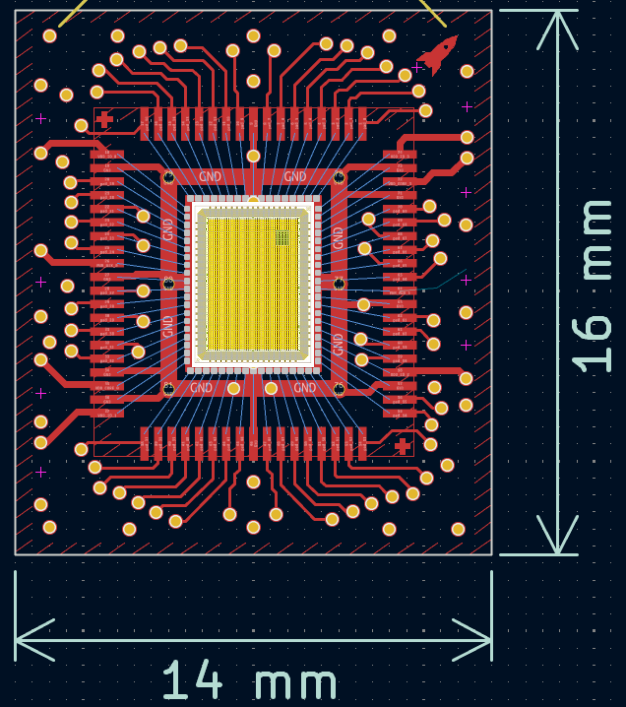

# Wirebonding Detail

## Workflow

Wirebonding is still a very **manual process** — there are no real exchange formats yet that
tie the die layout to the breakout PCB. To bridge that gap, we have written a script that ties
together the **GDS file** (die) and the **KiCad file** (breakout) and walks pin-for-pin around
the padframe, matching each die pad to its corresponding bond pad on the PCB.

## Design Rules

The following constraints apply when laying out bond wires:

* **No wires may cross.**
* **Wire angle must be not greater than 45°.**
* **Maximum wire length must be less than 3 mm** — though a wire that long would already add a
  significant amount of inductance, so keep them as short as practical.
* **Minimum wire length is 1 mm from the die, or 2× the die thickness** (whichever is greater).
* **No solder mask** is allowed in the area to be bonded.
