# Run 2

This directory holds the design files for **Run 2** of the [wafer.space](https://wafer.space) chip-on-board (COB) breakouts.

---

<!-- AUTO-GEN:START -->
<!-- Generated by .github/scripts/gen_docs.py on release. Edits between the AUTO-GEN markers will be overwritten. -->

## Board Renders

*Generated for release **unreleased** on 2026-10-08.*

### 0p5x0p5-cob / 0p5x0p5-cob

| 3D top | 3D bottom |
| :---: | :---: |
| 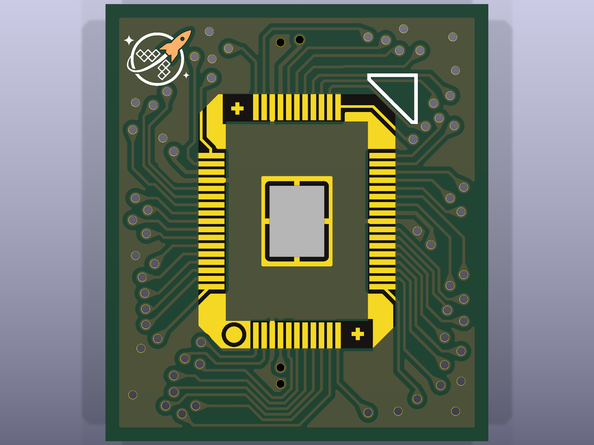 | 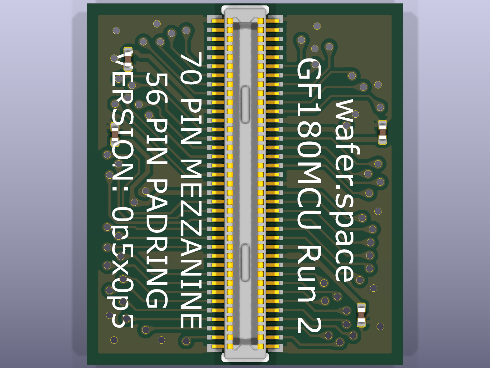 |

| Front layers | Back layers (mirrored) |
| :---: | :---: |
|  |  |

[PCB](0p5x0p5-cob/0p5x0p5-cob.kicad_pcb) · [Schematic source](0p5x0p5-cob/0p5x0p5-cob.kicad_sch) · [Schematic PDF](../docs/renders/run-2/0p5x0p5-cob/0p5x0p5-cob/schematic.pdf)

### 0p5x1-cob / mezzanine-0p5x1

| 3D top | 3D bottom |
| :---: | :---: |
| 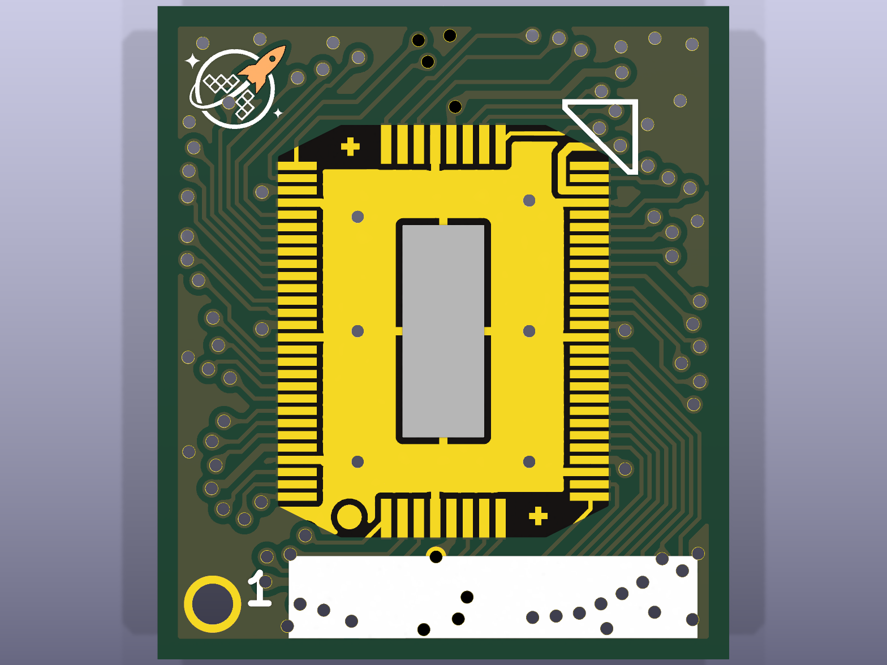 | 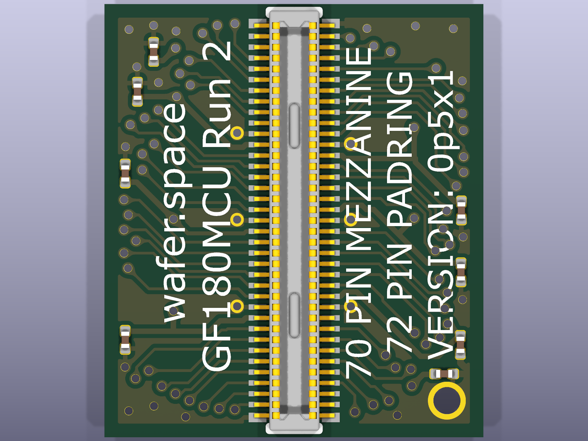 |

| Front layers | Back layers (mirrored) |
| :---: | :---: |
|  | 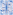 |

[PCB](0p5x1-cob/mezzanine-0p5x1.kicad_pcb) · [Schematic source](0p5x1-cob/mezzanine-0p5x1.kicad_sch) · [Schematic PDF](../docs/renders/run-2/0p5x1-cob/mezzanine-0p5x1/schematic.pdf)

### 1x0p5-cob / mezzanine-1x0p5

| 3D top | 3D bottom |
| :---: | :---: |
| 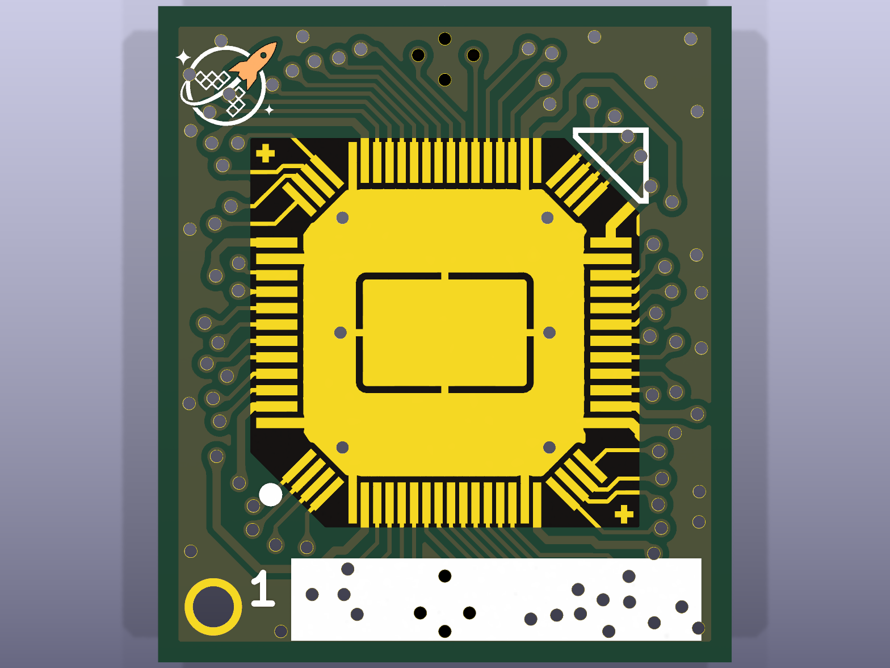 | 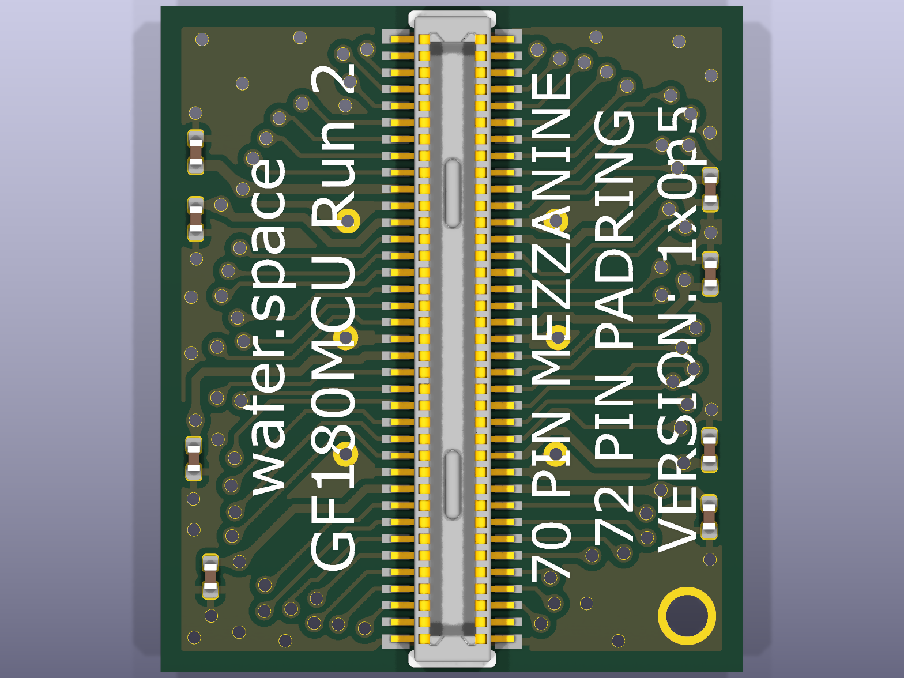 |

| Front layers | Back layers (mirrored) |
| :---: | :---: |
|  |  |

[PCB](1x0p5-cob/mezzanine-1x0p5.kicad_pcb) · [Schematic source](1x0p5-cob/mezzanine-1x0p5.kicad_sch) · [Schematic PDF](../docs/renders/run-2/1x0p5-cob/mezzanine-1x0p5/schematic.pdf)

### 1x1-cob / 1x1-mezzanine

| 3D top | 3D bottom |
| :---: | :---: |
| 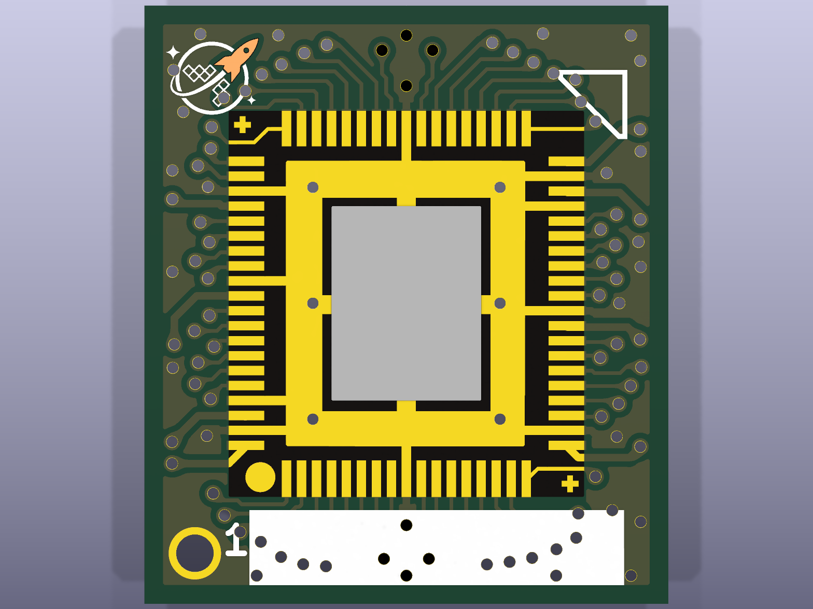 | 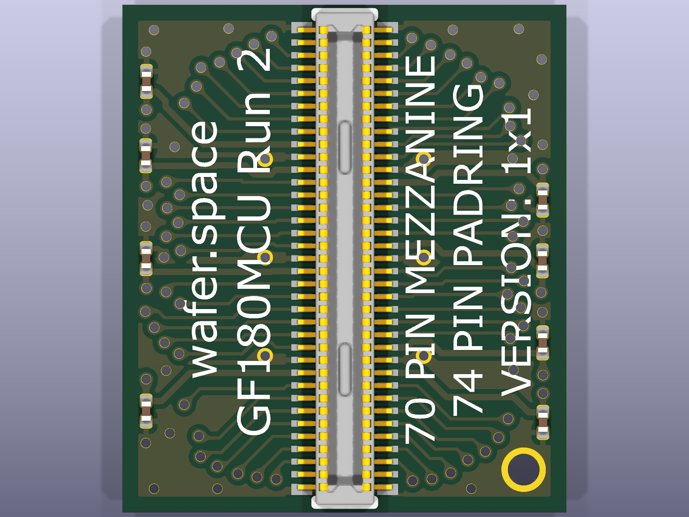 |

| Front layers | Back layers (mirrored) |
| :---: | :---: |
|  |  |

[PCB](1x1-cob/1x1-mezzanine.kicad_pcb) · [Schematic source](1x1-cob/1x1-mezzanine.kicad_sch) · [Schematic PDF](../docs/renders/run-2/1x1-cob/1x1-mezzanine/schematic.pdf)

### 1x1-cob / panelization / panel

| 3D top | 3D bottom |
| :---: | :---: |
| 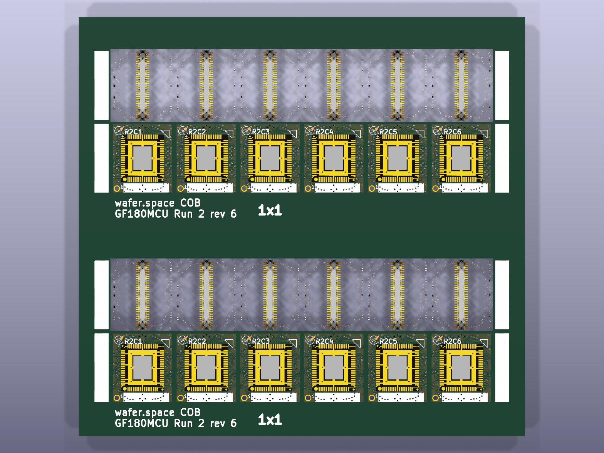 | 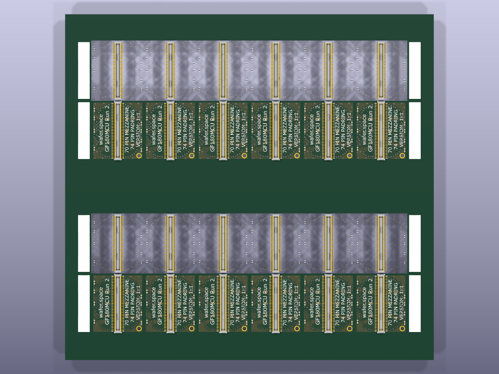 |

| Front layers | Back layers (mirrored) |
| :---: | :---: |
| 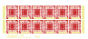 | 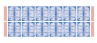 |

[PCB](1x1-cob/panelization/panel.kicad_pcb)
<!-- AUTO-GEN:END -->
